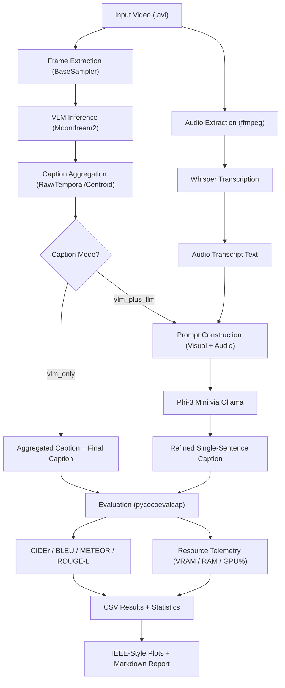

# Resource-Efficient Multimodal Video Captioning on Edge Devices

> **Single Source of Truth** — This document is the definitive reference for the project's architecture, research methodology, implementation details, and development guide. It is designed to be readable by new developers, external reviewers, and the original authors returning after extended absence.

> **Development Style**: This project is developed primarily through AI-assisted/vibe coding. This README compensates by documenting every design decision, failure mode, and architectural rationale that would otherwise be lost.

---

## Table of Contents

1. [Project Overview](#1-project-overview)
2. [Current Project Status](#2-current-project-status)
3. [Research Motivation](#3-research-motivation)
4. [High-Level System Architecture](#4-high-level-system-architecture)
5. [Complete Project Structure](#5-complete-project-structure)
6. [Detailed Pipeline Walkthrough](#6-detailed-pipeline-walkthrough)
7. [Sampling Methods](#7-sampling-methods)
8. [Aggregation Methods](#8-aggregation-methods)
9. [Model Documentation](#9-model-documentation)
10. [Benchmarking Framework](#10-benchmarking-framework)
11. [Evaluation Metrics](#11-evaluation-metrics)
12. [Hardware Support](#12-hardware-support)
13. [Design Decisions](#13-design-decisions)
14. [Failure Recovery & Edge Cases](#14-failure-recovery--edge-cases)
15. [Developer Guide](#15-developer-guide)
16. [Historical Evolution](#16-historical-evolution)
17. [Future Research Roadmap](#17-future-research-roadmap)
18. [Research Contribution](#18-research-contribution)
19. [Reproducibility Checklist](#19-reproducibility-checklist)

---

## 1. Project Overview

### What Is Video Captioning?

Video captioning is the task of automatically generating a natural-language description of the visual and auditory content in a video. Unlike image captioning — which describes a single static frame — video captioning must synthesize temporal dynamics, scene transitions, actions, and optionally spoken audio into a coherent textual summary.

### Why Does It Matter?

Video captioning underpins a broad spectrum of applications: accessibility tools for visually impaired users, automated video indexing and retrieval, content moderation, surveillance summarization, and social media content analysis. As the volume of video data grows exponentially, the demand for automated understanding far exceeds what human annotators can provide.

### Why Are Existing Approaches Expensive?

State-of-the-art video captioning models (e.g., VideoBLIP, GIT2, mPLUG-2) are typically designed for cloud-scale deployment. They require:

- **Massive VRAM**: 16–80 GB GPU memory for inference alone
- **Cloud API dependencies**: Many commercial solutions (GPT-4V, Gemini) require network access and per-token billing
- **Dense frame processing**: Processing every frame of a video at 30 FPS results in enormous computational overhead for minimal marginal quality gain

### Why Is Edge Deployment Challenging?

Edge devices — consumer laptops, single-board computers, mobile GPUs — face severe constraints:

- **Limited VRAM**: A laptop GPU like the RTX 4050 has only 6 GB VRAM, roughly 3–13× less than cloud GPUs
- **Shared memory**: GPU and CPU compete for the same physical memory pool on many platforms
- **Thermal throttling**: Sustained inference workloads on laptops trigger thermal throttling, making latency unpredictable
- **No cloud fallback**: Edge AI must operate entirely locally, without network-dependent API calls

### What This Project Attempts to Solve

This project investigates whether **intelligent frame selection** — choosing *which* frames to analyze rather than analyzing *all* of them — can reduce computational cost while maintaining caption quality on consumer-grade edge hardware.

The core research question:

> *"Can adaptive frame selection significantly reduce computational cost while maintaining caption quality on edge hardware?"*

**Current Phase**: TASS Integration & Evaluation — evaluating the Two-Stage Adaptive Semantic Sampling (TASS) algorithm against the baseline benchmarking configurations.

**Core Contribution**: **TASS** (Two-Stage Adaptive Semantic Sampling) — a novel content-aware sampling algorithm that uses lightweight visual similarity metrics to select maximally informative frames.

---

## 2. Current Project Status

The project has transitioned from baseline benchmarking to full TASS implementation. The table below distinguishes between what is implemented and operational versus what is planned for future research phases.

### Implemented Features ✓

| Feature | Status | Notes |
|---|---|---|
| MSVD Dataset Integration | ✅ Implemented | Auto-download, extraction, and caching from Hugging Face (`friedrichor/MSVD`) |
| Moondream2 VLM Integration | ✅ Implemented | Singleton loading, revision-pinned (`2024-08-26`), `float16` on CUDA |
| Whisper Integration | ✅ Implemented | Audio transcription via `openai-whisper`, configurable model size |
| Phi-3 Mini LLM Integration | ✅ Implemented | Served locally via Ollama, temperature 0.2, strict prompt constraints |
| FPS-1 Sampling | ✅ Implemented | 1 frame per second uniform extraction |
| FPS-2 Sampling | ✅ Implemented | 2 frames per second uniform extraction |
| Random Sampling | ✅ Implemented | Seeded random frame selection matching FPS-1 frame budget |
| SSIM Sampling (ssim_085/090/095) | ✅ Implemented | Structural similarity scene-change detection; adaptive temporal baseline. Three threshold variants (0.85, 0.90, 0.95). CPU-only streaming. TASS Stage 1 interface. |
| TASS Algorithm | ✅ Implemented | Two-Stage Adaptive Semantic Sampling — the core research contribution |
| MobileCLIP Integration | ✅ Implemented | Lightweight embedding model for semantic frame similarity |
| Raw Aggregation | ✅ Implemented | Sequential concatenation of all frame captions |
| Temporal Aggregation | ✅ Implemented | Jaccard similarity–based deduplication of consecutive captions |
| Centroid Aggregation | ✅ Implemented | Selects the single most representative caption via pairwise similarity |
| Evaluation Pipeline | ✅ Implemented | CIDEr, BLEU-1, BLEU-4, METEOR, ROUGE-L with full-corpus IDF |
| Benchmarking Framework | ✅ Implemented | Configurable via YAML, CLI overrides, CSV/plot/report output |
| Resource Monitoring | ✅ Implemented | Threaded peak VRAM, RAM delta, GPU utilization tracking (50ms polling) |
| Quality Metrics | ✅ Implemented | Per-video and corpus-level scoring with 95% confidence intervals |
| Visualization Pipeline | ✅ Implemented | 8 IEEE-style publication-quality figures (PNG + PDF); Fig 8: SSIM frame reduction % |
| WSL2 Compatibility | ✅ Implemented | Auto-detection, memory budgets, deterministic CUDA mode |

### Planned Features ✗

| Feature | Status | Notes |
|---|---|---|
| MSR-VTT Dataset | 🔲 Planned | Second evaluation dataset for cross-corpus generalization |
| Cross-Hardware Portability | 🔲 Planned | Apple M1 (MPS backend) comparative experiments |

> **⚠️ Important**: The features in the "Planned" table exist only as conceptual designs or future work descriptions. Do NOT reference them as functional. They appear exclusively in [Section 17: Future Research Roadmap](#17-future-research-roadmap).

---

## 3. Research Motivation

### Why Baseline Benchmarking Must Come First

A common failure in systems research is proposing a "better" algorithm without rigorously demonstrating what the current alternatives achieve. Before introducing a novel sampling algorithm (TASS), this project must:

1. **Establish quality baselines**: What CIDEr, BLEU-4, METEOR, and ROUGE-L scores do simple strategies achieve on MSVD with this specific model stack?
2. **Establish efficiency baselines**: How much time, VRAM, and RAM do FPS-1, FPS-2, and random sampling consume per video?
3. **Identify aggregation effects**: Does the choice of caption aggregation strategy (raw vs. temporal vs. centroid) interact with sampling method in non-obvious ways?
4. **Characterize the quality-efficiency tradeoff**: Is there a Pareto frontier? Are some configurations dominated (worse quality *and* worse efficiency)?

Without these baselines, any future claim of "TASS achieves X% speedup with only Y% quality loss" would be unmeasurable.

### Why Quality-Efficiency Tradeoffs Matter

In edge AI, maximizing quality is *not* the sole objective. A system that achieves a CIDEr of 1.5 but takes 30 seconds per video and exhausts 6 GB VRAM is unusable on a laptop. Conversely, a system that runs in 0.1 seconds but produces nonsensical captions is equally useless.

The real research question is about the **tradeoff**: given a computational budget, what is the best caption quality achievable? This project quantifies this tradeoff systematically.

### Why This Is More Than Software Integration

Wiring together Moondream2, Whisper, and Phi-3 Mini is engineering. The research contribution lies in:

- **Systematic ablation**: Testing every combination of sampling × aggregation × caption mode with controlled variables
- **Methodologically correct evaluation**: Using full-corpus IDF for CIDEr (not small-subset IDF, which produces degenerate scores), reporting 95% confidence intervals, and tracking resource consumption under deterministic CUDA settings
- **Edge-specific constraints**: Documenting and respecting the 6 GB VRAM budget, WSL2 memory pressure, and thermal throttling as first-class experimental concerns

---

## 4. High-Level System Architecture

### Current Pipeline Architecture

```text
┌──────────────────┐
│   Input Video    │
│   (.avi file)    │
└────────┬─────────┘
         │
         ├──────────────────────────────────────┐
         │                                      │
         ▼                                      ▼
┌──────────────────┐                 ┌─────────────────────┐
│ Frame Extraction │                 │ Audio Transcription  │
│  (BaseSampler)   │                 │ (ffmpeg → Whisper)   │
│                  │                 │                      │
│ FPS-1 / FPS-2 /  │                 │ Extracts audio track │
│ Random           │                 │ via ffmpeg, then     │
└────────┬─────────┘                 │ transcribes with     │
         │                           │ Whisper Base          │
         ▼                           └──────────┬────────────┘
┌──────────────────┐                            │
│ Frame Captioning │                            │
│  (Moondream2)    │                            │
│                  │                            │
│ Per-frame VLM    │                            │
│ inference on GPU │                            │
└────────┬─────────┘                            │
         │                                      │
         ▼                                      │
┌──────────────────┐                            │
│   Aggregation    │                            │
│  Strategy        │                            │
│                  │                            │
│ Raw / Temporal / │                            │
│ Centroid         │                            │
└────────┬─────────┘                            │
         │                                      │
         ▼                                      │
┌──────────────────────────────────────────────────┐
│              Context Builder                     │
│                                                  │
│  vlm_only mode:   return aggregated caption      │
│  vlm_plus_llm:    construct LLM prompt with      │
│                   visual summary + transcript     │
└────────┬─────────────────────────────────────────┘
         │
         ▼
┌──────────────────┐
│ Phi-3 Mini       │
│ (via Ollama)     │
│                  │
│ Refines into a   │
│ single sentence  │
│ (max 15 words)   │
└────────┬─────────┘
         │
         ▼
┌──────────────────┐
│ Final Caption    │
│ + Evaluation     │
│ + Telemetry      │
└──────────────────┘
```

### Data Flow Diagram



### Key Architectural Dependencies

| Stage | Input | Output | Dependencies |
|---|---|---|---|
| Frame Extraction | `.avi` video file | `List[np.ndarray]` (BGR frames) | OpenCV (`cv2`) |
| Audio Extraction | `.avi` video file | `.wav` audio file (16kHz mono) | `ffmpeg`, `ffprobe` |
| Frame Captioning | PIL Images (RGB) | `List[str]` (per-frame captions) | Moondream2, PyTorch, CUDA |
| Audio Transcription | `.wav` audio file | Transcript `str` | `openai-whisper` |
| Caption Aggregation | `List[str]` (captions) | Single `str` | NLTK (temporal, centroid) |
| LLM Refinement | Prompt `str` | Caption `str` (≤15 words) | Ollama, Phi-3 Mini |
| Evaluation | Generated + reference captions | Per-video metric scores | `pycocoevalcap`, Java (METEOR) |
| Telemetry | Background thread | Peak VRAM/RAM/GPU% | `pynvml`, `psutil` |

---

## 5. Complete Project Structure

```
research_project/
├── config/                  # Runtime configuration management
│   ├── __init__.py
│   └── settings.py          # Global settings singleton, WSL2 detection, memory budgets
│
├── configs/                 # Experiment configuration files (YAML)
│   └── benchmark.yaml       # Primary benchmark configuration
│
├── samplers/                # Frame sampling strategy implementations
│   ├── __init__.py          # Public API: exports all sampler classes + SSIMSamplerResult
│   ├── base_sampler.py      # Abstract base class defining the sampler interface
│   ├── fps1.py              # 1 frame-per-second uniform sampler
│   ├── fps2.py              # 2 frames-per-second uniform sampler
│   ├── random_sampler.py    # Seeded random frame selection sampler
│   ├── ssim.py              # SSIM scene-change sampler (streaming, CPU-only; TASS Stage 1)
│   └── dsis.py              # [STUB] Placeholder for future DSIS sampler (excluded/stub)
│
├── aggregation/             # Caption aggregation strategy implementations
│   ├── __init__.py          # Public API: exports all aggregator classes
│   ├── base.py              # Abstract base class defining the aggregator interface
│   ├── raw.py               # Simple sequential concatenation aggregator
│   ├── temporal.py          # Jaccard similarity–based temporal deduplication
│   └── centroid.py          # Pairwise similarity centroid selection
│
├── models/                  # Model loader and inference wrappers
│   ├── __init__.py          # Public API: exports VLMLoader, LLMLoader
│   ├── vlm_loader.py        # Moondream2 singleton loader with OOM recovery
│   └── llm_loader.py        # Ollama-based LLM client (Phi-3 Mini)
│
├── pipeline/                # Core pipeline stage implementations
│   ├── __init__.py          # Public API: exports all pipeline functions
│   ├── frame_extraction.py  # Delegates to sampler, records frame selection metadata
│   ├── frame_captioning.py  # VLM inference with caching and OOM handling
│   ├── audio_transcription.py # ffmpeg audio extraction + Whisper transcription
│   ├── context_builder.py   # Combines visual summary + audio transcript into LLM prompt
│   └── final_caption_generator.py  # Dispatches to Ollama or returns VLM-only output
│
├── evaluation/              # Metrics, telemetry, and statistical analysis
│   ├── __init__.py
│   ├── metrics.py           # CIDEr (custom scorer), BLEU, ROUGE-L, METEOR evaluation
│   ├── corpus_idf.py        # Full MSVD corpus IDF builder and cache for CIDEr
│   ├── statistics.py        # Mean, median, std, CI95 computation per configuration
│   └── telemetry.py         # PeakResourceTracker context manager (threaded polling)
│
├── experiments/             # Experiment execution scripts
│   ├── __init__.py
│   └── run_benchmark.py     # Main entry point: dataset loading, pipeline orchestration
│
├── visualization/           # Publication-quality plotting
│   ├── __init__.py
│   └── plots.py             # Seaborn/Matplotlib grouped bar charts + Pareto scatter
│
├── utils/                   # Shared utility functions
│   ├── __init__.py
│   └── gpu.py               # VRAM flush utility (gc.collect + CUDA cache clear)
│
├── results/                 # All experiment outputs (gitignored contents)
│   ├── csv/                 # Raw per-video results + aggregated statistics summaries
│   ├── plots/               # Generated PNG and PDF figures (Figs 1-8)
│   ├── reports/             # Auto-generated Markdown benchmark summary reports
│   ├── captions/            # Per-video generated captions + ground truth JSON
│   ├── frame_selection/     # Per-video frame index + SSIM metadata JSON
│   ├── metadata/            # Run info JSON (GPU, CPU, model names, timestamps)
│   ├── logs/                # Timestamped benchmark execution logs
│   └── cache/               # Precomputed corpus IDF pickle
│
├── tests/                   # Unit and edge-case tests
│   └── test_ssim_sampler.py # SSIMSampler edge case test suite (11 tests)
│
├── cache/                   # Intermediate pipeline artifacts (speeds up reruns)
│   ├── *.avi                # Downloaded MSVD video files
│   ├── frame_captions/      # Cached per-video VLM captions (JSON)
│   └── transcripts/         # Cached per-video Whisper transcripts (JSON)
│
├── requirements.txt         # Pinned Python dependencies
├── README.md                # This document
├── CHANGES.md               # Detailed changelog of all bug fixes and patches
└── changes_log_prod.md      # Production deployment fixes log
```

### Why Each Directory Exists

| Directory | Responsibility | Interacts With |
|---|---|---|
| `config/` | Centralizes runtime settings (YAML parsing, WSL2 detection, memory budget constants). Every module imports from `config.settings`. | All modules |
| `configs/` | Stores declarative experiment configurations. Separates *what* to run from *how* to run it. | `experiments/run_benchmark.py` |
| `samplers/` | Encapsulates frame selection logic behind a common `BaseSampler` interface. Adding a new sampler requires only a new file here. | `pipeline/frame_extraction.py` |
| `aggregation/` | Encapsulates caption combination logic behind a common `BaseAggregator` interface. | `pipeline/context_builder.py` |
| `models/` | Wraps model loading and inference behind clean interfaces. Handles VRAM management, OOM recovery, and Ollama HTTP communication. | `pipeline/frame_captioning.py`, `pipeline/final_caption_generator.py` |
| `pipeline/` | Implements each stage of the video-to-caption pipeline as a pure function. Stages are stateless and composable. | `experiments/run_benchmark.py` |
| `evaluation/` | Owns all quality measurement (NLP metrics), resource measurement (telemetry), and statistical aggregation. | `experiments/run_benchmark.py` |
| `experiments/` | The only module that orchestrates the full benchmark. Contains the `main()` entry point, dataset loading, loop nesting, and output generation. | Everything |
| `visualization/` | Generates publication-quality figures from raw CSV data. Completely decoupled from pipeline execution. | `results/csv/` |
| `utils/` | Shared low-level utilities (currently just VRAM flushing). Kept minimal to avoid a "junk drawer" anti-pattern. | `models/`, `pipeline/` |
| `results/` | Write-only output directory. Organized by artifact type (CSV, plots, reports, logs). Each run creates timestamped files. | Generated by `experiments/`, `visualization/` |
| `cache/` | Memoization layer. Caching VLM captions and Whisper transcripts avoids re-running expensive inference on repeated benchmark runs. | `pipeline/frame_captioning.py`, `pipeline/audio_transcription.py` |

---

## 6. Detailed Pipeline Walkthrough

This section traces a single video through the complete pipeline, documenting the input, output, dependencies, and failure modes at each stage.

### Stage 1: Video Input & Dataset Loading

- **Input**: Hugging Face dataset identifier (`friedrichor/MSVD`)
- **Output**: A shuffled subset of video metadata rows and corresponding `.avi` files in `./cache/`
- **Dependencies**: `datasets` library, `huggingface_hub` for video ZIP download
- **Implementation**: `ensure_msvd_videos()` in `experiments/run_benchmark.py`

**What happens**: On first run, the benchmark downloads `MSVD_Videos.zip` (1.8 GB) from Hugging Face, extracts all `.avi` files, and flattens them into `./cache/`. The dataset metadata (video IDs, captions) is loaded separately via `load_dataset()`. Videos are shuffled with a fixed seed (default: 42) and truncated to the requested count.

**Failure modes**:
- Network failure during download → logged error, benchmark cannot proceed
- Disk space exhaustion during extraction → partial cache, subsequent runs may find incomplete files
- Missing video files → individual videos are skipped with a warning

### Stage 2: Frame Extraction

- **Input**: Video file path (`str`) + sampler instance (`BaseSampler`)
- **Output**: `List[np.ndarray]` — BGR frames as NumPy arrays (H×W×3)
- **Dependencies**: OpenCV (`cv2`)
- **Implementation**: `pipeline/frame_extraction.py` → delegates to `sampler.sample()`

**What happens**: The selected sampler opens the video with OpenCV, reads frames according to its strategy (see [Section 7](#7-sampling-methods)), and returns them as a list. Frame selection metadata (including the actual frame indices within the video stream, recovered via sampler index tracking) is saved to `results/frame_selection/{video_id}_{method}.json`.

**Failure modes**:
- Corrupted video file → OpenCV returns `ret=False` on first read, resulting in an empty frame list
- Zero-FPS metadata → samplers default to assuming 30 FPS
- Extremely long videos → memory pressure from holding all frames in RAM simultaneously

### Stage 3: Frame Captioning (VLM)

- **Input**: `List[np.ndarray]` (BGR frames)
- **Output**: `List[str]` (per-frame captions), `bool` (OOM recovery flag)
- **Dependencies**: Moondream2 (PyTorch, `transformers`), CUDA
- **Implementation**: `pipeline/frame_captioning.py` → `VLMLoader.generate_captions()`

**What happens**: Frames are converted from BGR (OpenCV) to RGB (PIL). Each frame is encoded by Moondream2's image encoder, then captioned with the prompt `"Describe this image in a short sentence."`. Results are cached to `cache/frame_captions/{video_id}_{method}_{model_safe}_{revision_safe}.json` — subsequent runs skip inference entirely. This ensures that changing models or pinning revisions avoids stale cache reuse.

**Failure modes**:
- CUDA OOM → batch size is halved automatically (down to 1), VRAM is flushed, and retried. If batch size 1 still OOMs, a placeholder caption is inserted.
- Model not loaded → raises `RuntimeError` (strict singleton enforcement)
- Hugging Face cache corruption → requires manual deletion of `~/.cache/huggingface/modules/`

### Stage 4: Audio Transcription

- **Input**: Video file path (`str`)
- **Output**: `(transcript: str, audio_present: bool, audio_duration: float)`
- **Dependencies**: `ffmpeg`, `ffprobe`, `openai-whisper`
- **Implementation**: `pipeline/audio_transcription.py`

**What happens**:
1. `ffprobe` checks whether the video contains an audio stream
2. If audio exists, `ffmpeg` extracts it as a 16kHz mono WAV file
3. Whisper transcribes the WAV file with `condition_on_previous_text=False` and a configurable `no_speech_threshold` (default: 0.7)
4. The temporary WAV file is deleted after transcription
5. Results are cached to `cache/transcripts/{video_id}.json`

**Failure modes**:
- No audio stream → returns empty string, `audio_present=False` (graceful degradation)
- `ffmpeg` not installed → `subprocess.CalledProcessError`, logged and returns empty transcript
- Silent audio → Whisper returns empty or low-confidence text (controlled by `no_speech_threshold`)
- Corrupted audio → `ffmpeg` extraction failure, returns empty transcript with `audio_present=True`

### Stage 5: Caption Aggregation

- **Input**: `List[str]` (per-frame captions), `str` (audio transcript), aggregator instance, caption mode
- **Output**: `str` — either the aggregated caption (VLM-only) or a constructed LLM prompt (VLM+LLM)
- **Dependencies**: NLTK (`punkt`, `punkt_tab` tokenizers for temporal/centroid; dynamically resolved using standard NLTK search paths and downloaded to default user directories at runtime)
- **Implementation**: `pipeline/context_builder.py`

**What happens**: The aggregator combines multiple frame captions into a single textual representation (see [Section 8](#8-aggregation-methods)). In `vlm_only` mode, this aggregated text *is* the final caption. In `vlm_plus_llm` mode, the aggregated text is embedded into a strictly constrained LLM prompt alongside the audio transcript.

**The LLM prompt enforces**:
1. Exactly one output sentence
2. No conversational filler ("The video shows...", "Here is a summary...")
3. Maximum 15 words
4. Literal action description only

**Why 15 words?** Longer outputs introduce conversational filler that collapses BLEU-4 scores due to n-gram dilution. The 15-word limit was empirically tuned to prevent this failure mode.

### Stage 6: LLM Refinement (Optional)

- **Input**: Prompt `str` (visual summary + audio transcript)
- **Output**: `str` (refined single-sentence caption)
- **Dependencies**: Ollama (running locally), Phi-3 Mini model
- **Implementation**: `pipeline/final_caption_generator.py` → `LLMLoader.generate()`

**What happens**: In `vlm_plus_llm` mode, the constructed prompt is sent to the local Ollama server via HTTP POST. Phi-3 Mini generates a response with `temperature=0.2` (near-deterministic) and `stream=False`. VRAM is flushed before LLM generation to maximize available memory.

In `vlm_only` mode, this stage is a no-op: the aggregated caption is returned directly.

**Failure modes**:
- Ollama not running → `requests.ConnectionError`, returns `"Failed to generate caption."`
- Ollama timeout (120s) → `requests.Timeout`, returns `None` → replaced with failure placeholder
- Model not pulled → Ollama returns an error, caught and logged

### Stage 7: Evaluation & Telemetry

- **Input**: Generated captions + reference captions (from MSVD)
- **Output**: Per-video metric scores, per-video resource consumption, aggregated statistics
- **Dependencies**: `pycocoevalcap`, Java (METEOR), `pynvml`, `psutil`, `scipy`
- **Implementation**: `evaluation/metrics.py`, `evaluation/telemetry.py`, `evaluation/statistics.py`

**What happens**: After processing all videos for a given configuration (sampler × aggregator × caption mode), corpus-level metrics are computed using `pycocoevalcap`. A custom `CiderScorer` subclass injects the precomputed full-MSVD-corpus IDF weights (see [Section 11](#11-evaluation-metrics) for why this matters). Resource telemetry is collected by a background thread that polls VRAM, RAM, and GPU utilization every 50ms during pipeline execution.

Results are written to:
- `results/csv/results_{timestamp}.csv` — raw per-video data
- `results/csv/statistics_summary_{timestamp}.csv` — aggregated means, medians, CIs
- `results/plots/` — 7 publication-quality figures
- `results/reports/benchmark_summary_{timestamp}.md` — auto-generated report

---

## 7. Sampling Methods

Sampling determines **which frames** from the video are sent to the VLM for captioning. This is the most computationally impactful decision in the pipeline: processing fewer frames means fewer VLM inference calls, which directly reduces latency and VRAM usage.

### FPS-1 (1 Frame Per Second)

**Implementation**: `samplers/fps1.py` → `FPS1Sampler`

**Algorithm**:
1. Open the video with OpenCV and read its native FPS (e.g., 30 FPS)
2. Compute `frame_interval = round(native_fps)` — this gives ≈1 frame per second
3. Iterate through all frames; keep every `frame_interval`-th frame
4. Return the selected frames

**Example**: A 10-second video at 30 FPS has 300 total frames. FPS-1 selects 10 frames.

| Property | Value |
|---|---|
| Frames selected | ≈ `ceil(duration_seconds)` |
| Computational cost | Low — minimal overhead beyond OpenCV frame reading |
| Deterministic? | Yes — same video always produces same frames |
| Advantages | Simple, reproducible, provides temporal coverage of entire video |
| Limitations | Blind to content — may select redundant frames from static scenes or miss key moments in fast-action sequences |

### FPS-2 (2 Frames Per Second)

**Implementation**: `samplers/fps2.py` → `FPS2Sampler`

**Algorithm**:
1. Same as FPS-1, but `frame_interval = round(native_fps / 2.0)`
2. This yields approximately 2 frames per second

**Example**: A 10-second video at 30 FPS has 300 total frames. FPS-2 selects 20 frames.

| Property | Value |
|---|---|
| Frames selected | ≈ `2 × duration_seconds` |
| Computational cost | 2× the VLM inference cost of FPS-1 |
| Deterministic? | Yes |
| Advantages | Better temporal resolution — less likely to miss short events |
| Limitations | 2× the processing time of FPS-1 for potentially marginal quality gains. Still content-blind. |

### Random Sampling

**Implementation**: `samplers/random_sampler.py` → `RandomSampler`

**Algorithm**:
1. Read total frame count and native FPS
2. Compute `target_count = ceil(total_frames / native_fps)` — matches FPS-1's frame budget
3. Randomly select `target_count` frame indices from `[0, total_frames)` using a fixed seed (default: 42)
4. Sort selected indices and extract the corresponding frames

**Example**: A 10-second video at 30 FPS produces `target_count = 10` frames, randomly distributed across the video.

| Property | Value |
|---|---|
| Frames selected | Same count as FPS-1 (fair comparison) |
| Computational cost | Same VLM cost as FPS-1 |
| Deterministic? | Yes (seeded) — reproducible across runs |
| Advantages | Provides a randomized baseline to test whether temporal uniformity matters |
| Limitations | May cluster frames in time (no spacing guarantee), may miss key events. Falls back to FPS-1 if metadata is corrupted (`total_frames ≤ 0` or `fps ≤ 0`). |

**Design Decision**: Random sampling uses the same frame budget as FPS-1 to enable a fair quality comparison. If random sampling achieves comparable quality, it suggests that temporal uniformity provides no intrinsic advantage — an important finding for the research.

### SSIM Sampling

**Implementation**: `samplers/ssim.py` → `SSIMSampler`

**Algorithm**:
1. Open the video and decode frames.
2. Downsample frames to $256 \times 144$ to minimize CPU overhead.
3. Compute the Structural Similarity Index (SSIM) between consecutive frames using `scikit-image`.
4. If the SSIM falls below the configured threshold (e.g., `ssim_085`, `ssim_090`, or `ssim_095`), register a scene change and select the frame.
5. Save frame selection metadata to `results/frame_selection/` and return `SSIMSamplerResult`.

**Frame Reduction Calculation**:
The frame reduction percentage is calculated as:
$$\text{reduction\_pct} = \left(1.0 - \frac{\text{len(accepted\_frames)}}{\max(\text{total\_frames\_meta}, 1)}\right) \times 100.0$$
where $\text{total\_frames\_meta}$ is the total frame count declared in the video container's metadata (e.g., via `CAP_PROP_FRAME_COUNT`), rather than the count of physically read/decoded frames. This ensures that any corrupted or truncated frames during decoding do not skew the reduction percentage calculation.

| Property | Value |
|---|---|
| Thresholds | `0.85`, `0.90`, `0.95` |
| Computational cost | Moderate CPU computation for SSIM on downsampled frames |
| Deterministic? | Yes |
| Advantages | Captures visual scene shifts and temporal boundaries, dropping redundant adjacent frames |
| Limitations | Blind to semantic meaning (e.g. two visually distinct scenes could describe the same semantic action, or moving objects might not trigger SSIM if the background is static) |

---

### TASS (Two-Stage Adaptive Semantic Sampling)

**Implementation**: `samplers/tass.py` → `TASSSampler`

**Algorithm**:
* **Stage 1 — Streaming Degenerate Purge + Grid-SSIM Pre-filter**:
  1. *Degenerate Purge*: Filters out frames with extreme brightness/variance (flash, fade, dark lens-caps) using fast NumPy threshold checks.
  2. *2×2 Grid-SSIM Quadrant Filter*: Divides downsampled frames into a 2×2 grid, computes SSIM independently per quadrant, and takes the *minimum* score. This avoids foreground motion being masked by a static background.
* **Stage 2 — Semantic Refinement via Farthest-Point Selection (FPS)**:
  1. *MobileCLIP Embeddings*: Encodes candidate frames into 512-dimensional, L2-normalized vectors using a CPU-only singleton model (`MobileCLIPEmbedder`).
  2. *Greedy Farthest-Point Selection*: Iteratively selects the frame that maximizes the minimum cosine distance to the already selected set, ensuring optimal coverage of the semantic space (runs in $O(Mk)$ complexity where $M$ is the candidate pool size and $k$ is the selected frame budget, optimized with $O(1)$ set-based membership lookups).

**Modes**:
* `fixed`: Selects exactly $K = \lceil duration\_seconds \rceil$ frames to match the FPS-1 uniform budget, isolating algorithmic efficiency.
* `adaptive`: Halts early if the minimum cosine distance of the next candidate drops below `min_distance` (default: 0.10), preventing forced selection of redundant content.

| Property | Value |
|---|---|
| Configuration Names | `tass_fixed`, `tass_adaptive` |
| Embedding Model | `MobileCLIP-S1` (runs exclusively on CPU, consuming ~85 MB RAM) |
| Deterministic? | Yes |
| Advantages | Minimizes VLM calls while maximizing semantic coverage; avoids VRAM footprint on edge GPUs |
| Limitations | Stage 2 requires CPU inference for the embedding model (mitigated via singleton load and mini-batching) |

---

## 8. Aggregation Methods

Aggregation determines **how** multiple per-frame captions are combined into a single textual representation before (optionally) being refined by the LLM.

### Raw Aggregation

**Implementation**: `aggregation/raw.py` → `RawAggregator`

**How it works**: Concatenates all frame captions with a single space separator.

```
Input:  ["A dog runs.", "A dog jumps.", "A dog catches a ball."]
Output: "A dog runs. A dog jumps. A dog catches a ball."
```

| Property | Value |
|---|---|
| Why it exists | Baseline — preserves all information without any reduction |
| Advantages | Zero information loss; the LLM receives maximum context |
| Limitations | Produces long, repetitive text — especially problematic for BLEU-4 scoring. For FPS-2, the input to the LLM can be very long, potentially exceeding Phi-3's effective context window for coherent summarization. |
| Resource cost | Negligible CPU cost; but longer prompts increase LLM inference time |

### Temporal Aggregation

**Implementation**: `aggregation/temporal.py` → `TemporalAggregator`

**How it works**:
1. Iterate through captions in temporal order
2. For each caption, compute Jaccard similarity with the *previous* caption
3. If similarity exceeds 0.85 (85%), discard the caption as redundant
4. Return the remaining unique captions, joined with spaces

**Jaccard similarity** is computed on tokenized, lowercased, punctuation-stripped word sets:

```
J(A, B) = |A ∩ B| / |A ∪ B|
```

```
Input:  ["A dog runs.", "A dog runs fast.", "A dog catches a ball."]
         Jaccard("A dog runs", "A dog runs fast") = 3/4 = 0.75 → KEEP
         Jaccard("A dog runs fast", "A dog catches a ball") = 2/6 = 0.33 → KEEP
Output: "A dog runs. A dog runs fast. A dog catches a ball."

Input:  ["A dog runs.", "A dog runs.", "A dog catches a ball."]
         Jaccard("A dog runs", "A dog runs") = 1.0 → DROP
         Jaccard("A dog runs", "A dog catches a ball") = 2/5 = 0.40 → KEEP
Output: "A dog runs. A dog catches a ball."
```

| Property | Value |
|---|---|
| Why it exists | Eliminates redundant captions from static scenes where consecutive frames produce near-identical descriptions |
| Advantages | Reduces prompt length without losing temporally distinct information |
| Limitations | Only compares *adjacent* captions — non-adjacent duplicates are not detected. The 0.85 threshold is fixed; different video types may benefit from different thresholds. |
| Resource cost | O(n) tokenization + set operations — negligible compared to VLM inference |

### Centroid Aggregation

**Implementation**: `aggregation/centroid.py` → `CentroidAggregator`

**How it works**:
1. Tokenize and normalize all captions into word sets
2. Compute pairwise Jaccard similarity between all caption pairs
3. For each caption, sum its similarity to all other captions (centrality score)
4. Return the single caption with the highest centrality score

```
Input:  ["A dog runs.", "A dog catches a ball.", "A dog plays in the park."]
         Scores: [sum of similarities for each caption]
         Most central caption: "A dog catches a ball." (hypothetically)
Output: "A dog catches a ball."
```

| Property | Value |
|---|---|
| Why it exists | Selects the single most "representative" caption — a strong compression strategy |
| Advantages | Produces the shortest possible output (single sentence), ideal for `vlm_only` mode. Naturally resistant to outlier frames. |
| Limitations | Discards all information except the single most central caption. For videos with distinct temporal phases, this loses critical information. O(n²) pairwise comparisons, though n is small (typically 5–20 frames). |
| Resource cost | O(n²) tokenization + set operations — still negligible vs. VLM inference |

### Aggregation × Caption Mode Interaction

The choice of aggregation strategy interacts significantly with the caption mode:

| | `vlm_only` | `vlm_plus_llm` |
|---|---|---|
| **Raw** | Long, repetitive text *is* the final caption. Produces poor BLEU scores. | LLM receives maximum context but must summarize effectively. |
| **Temporal** | Deduplicated text improves readability but may still be multi-sentence. | LLM receives cleaner input with less redundancy. |
| **Centroid** | Single sentence — cleanest `vlm_only` output. Risk of information loss. | LLM receives minimal context — relies on the centroid being representative. |

---

## 9. Model Documentation

### Moondream2 — Vision-Language Model (VLM)

| Property | Value |
|---|---|
| **Model ID** | `vikhyatk/moondream2` |
| **Parameters** | 1.86 billion |
| **Purpose** | Generate natural-language descriptions of individual video frames |
| **Input** | Single RGB image (PIL format) |
| **Output** | Short descriptive sentence (e.g., "A dog catches a frisbee in a park.") |
| **Precision** | `torch.float16` — halves VRAM usage vs. `float32` |
| **VRAM Footprint** | ~3.5–4 GB on CUDA at `float16` |
| **Revision** | Pinned to `2024-08-26` to prevent dynamic cache corruption |
| **Loading Pattern** | Singleton — loaded once before benchmark loops, kept alive in VRAM for the entire run |
| **Loading Order** | Model loaded first (`AutoModelForCausalLM`), tokenizer loaded second (`AutoTokenizer`) — order matters due to `trust_remote_code=True` class compilation |
| **Prompt** | `"Describe this image in a short sentence."` |

**Why Moondream2?**
- Fits within the 6 GB VRAM budget at `float16`
- Does not require cloud APIs — runs entirely on-device
- Specifically designed for efficient image understanding
- The `trust_remote_code=True` requirement introduces stability challenges (see [Section 14](#14-failure-recovery--edge-cases)), but the model's quality-to-size ratio justifies this tradeoff

### Whisper Base — Audio Transcription Model

| Property | Value |
|---|---|
| **Model ID** | `openai-whisper` (configurable size: `tiny`, `base`, `small`) |
| **Configured Size** | `tiny` in `benchmark.yaml` (can be overridden) |
| **Parameters** | 39M (tiny), 74M (base), 244M (small) |
| **Purpose** | Transcribe spoken audio from video tracks into text |
| **Input** | 16kHz mono WAV audio file |
| **Output** | Transcript `str` |
| **Device** | Runs on CUDA if available, CPU otherwise |
| **Loading Pattern** | Singleton — loaded on first call, reused across videos |
| **Key Settings** | `condition_on_previous_text=False`, `no_speech_threshold=0.7` |

**Why Whisper?**
- Runs entirely on-device — no cloud API required
- Robust to background noise and accented speech
- Multiple size options allow tuning the quality-latency tradeoff
- The `tiny` model adds minimal latency while capturing spoken content when present

**Why `condition_on_previous_text=False`?**
- Prevents hallucination cascading: if Whisper hallucinates a phrase in one segment, setting this to `True` would condition subsequent segments on that hallucination, amplifying the error

### Phi-3 Mini — Refinement Language Model (LLM)

| Property | Value |
|---|---|
| **Model ID** | `phi3:mini` (via Ollama) |
| **Parameters** | 3.8 billion |
| **Purpose** | Refine aggregated frame captions + audio transcript into a single coherent sentence |
| **Input** | Structured prompt containing visual summary and audio transcript |
| **Output** | Single sentence, ≤15 words |
| **Hosting** | Ollama framework, served locally on port 11434 |
| **Temperature** | 0.2 (near-deterministic) |
| **Timeout** | 120 seconds per generation |
| **Keep-Alive** | 1 hour (model stays warm in Ollama memory between calls) |

**Why Phi-3 Mini?**
- Small enough to coexist in memory alongside Moondream2 on a 6 GB GPU
- Ollama serves it efficiently with automatic memory management
- At 3.8B parameters, it provides strong instruction-following for the constrained prompt format
- Superior instruction adherence compared to Llama3 for this specific prompt template (empirically observed)

> **⚠️ Historical Note**: Early benchmark runs (visible in some `results/reports/` files) used `llama3:latest` as the LLM. The project has since migrated to `phi3:mini` as the standard. See [Section 16](#16-historical-evolution) for details.

---

## 10. Benchmarking Framework

### Current Experiment Matrix

The benchmark evaluates every combination in a 6×3×2 factorial design:

| Dimension | Values | Count |
|---|---|---|
| Sampling Methods | FPS-1, FPS-2, Random, ssim_085, ssim_090, ssim_095 | 6 |
| Aggregation Methods | Raw, Temporal, Centroid | 3 |
| Caption Modes | `vlm_only`, `vlm_plus_llm` | 2 |
| **Total Configurations** | | **36** |

> **⚠️ Benchmark Matrix Warning**: Adding SSIM variants doubles wall-clock time vs. the original 18-config baseline run. Run `--sampler ssim_090 --videos 10` as a smoke test before committing to a full 50-video sweep.

Each configuration is evaluated across N videos (configurable, default: 10, production run: 50).

### Experiment Descriptions

**Experiment 1: FPS-1 Baseline**
- Samples 1 frame per second — the minimum temporal coverage baseline
- Tests whether sparse uniform sampling provides sufficient visual information
- Combined with all 3 aggregation methods and both caption modes → 6 configurations

**Experiment 2: FPS-2 Extended**
- Doubles the sampling rate to 2 FPS
- Tests whether doubling the frame budget improves quality proportionally
- Expected to show diminishing returns on certain aggregation strategies
- Combined with all 3 aggregation methods and both caption modes → 6 configurations

**Experiment 3: Random Baseline**
- Uses the same frame count as FPS-1 but with random temporal placement
- Tests whether temporal uniformity matters for caption quality
- If random ≈ FPS-1 quality, it suggests frame *timing* is less important than frame *count*
- Combined with all 3 aggregation methods and both caption modes → 6 configurations

### How Benchmarks Are Executed

```bash
# Small test run (1 video, all configurations)
PYTHONPATH=. python experiments/run_benchmark.py --videos 1

# Full benchmark (50 videos)
PYTHONPATH=. python experiments/run_benchmark.py --videos 50

# Specific sampler only
PYTHONPATH=. python experiments/run_benchmark.py --sampler fps1 --videos 10

# Custom output directory
PYTHONPATH=. python experiments/run_benchmark.py --output-dir ./results_v2 --videos 10
```

### Available CLI Arguments

| Flag | Default | Description |
|---|---|---|
| `--videos` | 10 (from YAML) | Number of videos to process |
| `--config` | `configs/benchmark.yaml` | Path to configuration file |
| `--sampler` | All (from YAML) | Run specific sampler only |
| `--aggregation` | All (from YAML) | Run specific aggregation only |
| `--model` | `phi3:mini` (from YAML) | Override Ollama LLM model |
| `--output-dir` | `./results` (from YAML) | Custom output directory |
| `--log-level` | `INFO` | Logging level (DEBUG, INFO, WARNING) |

### How Results Are Stored

Each benchmark run creates timestamped output files:

| Output | Path | Contents |
|---|---|---|
| Raw results | `results/csv/results_{timestamp}.csv` | Per-video scores + telemetry for all configurations |
| Statistics | `results/csv/statistics_summary_{timestamp}.csv` | Mean, median, std, min, max, CI95 per configuration |
| Plots | `results/plots/fig{1-7}.{png,pdf}` | Publication-quality ablation charts and Pareto scatter |
| Report | `results/reports/benchmark_summary_{timestamp}.md` | Auto-generated Markdown summary with highlights |
| Metadata | `results/metadata/run_info_{timestamp}.json` | GPU name, CPU, model names, video count |
| Logs | `results/logs/benchmark_{timestamp}.log` | Full execution log |
| Skipped | `results/logs/skipped_{timestamp}.txt` | List of videos that errored during processing |
| Captions | `results/captions/{vid}_{method}_{agg}_{mode}.json` | Generated + ground truth for manual inspection |

### How Reproducibility Is Maintained

1. **Fixed random seed** (default: 42) — deterministic dataset shuffling and random sampling
2. **Deterministic CUDA** — `torch.backends.cudnn.deterministic = True`, `benchmark = False`
3. **Pinned model revision** — Moondream2 locked to `revision="2024-08-26"`
4. **Pinned dependencies** — `requirements.txt` specifies exact versions
5. **Cached intermediates** — VLM captions and Whisper transcripts are cached, ensuring re-runs produce identical inputs to downstream stages
6. **Full-corpus IDF** — CIDEr evaluation uses the complete MSVD corpus IDF (cached as pickle), not the small evaluation subset

---

## 11. Evaluation Metrics

### Quality Metrics

#### CIDEr (Consensus-based Image Description Evaluation)

**Why selected**: CIDEr is specifically designed for image/video captioning evaluation. Unlike BLEU, it weights n-grams by their TF-IDF importance, penalizing generic phrases ("a person is") and rewarding descriptive specifics ("a golden retriever catches a frisbee").

**Formula**:
```
CIDEr_n(c_i, S_i) = (1/m) Σ_j [ (g^n(c_i) · g^n(s_{ij})) / (||g^n(c_i)|| × ||g^n(s_{ij})||) × e^(-(δ²)/(2σ²)) ]
```

Where:
- `g^n(c)` = TF-IDF weighted n-gram vector
- `δ` = length difference between hypothesis and reference
- `σ` = 6.0 (length penalty parameter)
- Final CIDEr = average over n = 1..4, multiplied by 10

**Critical implementation detail**: This project uses a **custom `CiderScorer` subclass** (`evaluation/metrics.py`) that:
1. Bypasses `pycocoevalcap`'s internal test-size assertion (which crashes on small evaluation subsets)
2. Injects precomputed IDF weights from the **full MSVD corpus** (1,970 videos, ~80K captions) rather than computing IDF on the evaluation subset

**Why full-corpus IDF?** When evaluating on 10–50 videos, computing IDF on just those videos produces degenerate weights: common words get near-zero IDF (because they appear in "most" of the 10 documents), making CIDEr scores meaninglessly small or unstable. Using the full corpus of 1,970 videos produces stable, meaningful IDF weights that correctly distinguish common from rare n-grams.

**Score range**: [0, 10] — higher is better. Typical MSVD scores: 0.3–1.5 for competitive methods.

#### BLEU (BiLingual Evaluation Understudy)

**BLEU-1**: Unigram precision — what fraction of individual words in the generated caption appear in any reference caption.

**BLEU-4**: 4-gram precision — what fraction of 4-word sequences in the generated caption appear in any reference. This is far more stringent: it rewards syntactically correct, fluent output.

**Why both?** BLEU-1 measures vocabulary overlap (content recall). BLEU-4 measures structural similarity (fluency). A high BLEU-1 with low BLEU-4 suggests the right words are present but in the wrong order.

**Score range**: [0, 1] — higher is better.

#### METEOR (Metric for Evaluation of Translation with Explicit ORdering)

**Why selected**: METEOR accounts for synonyms, stemming, and word order — addressing known weaknesses of BLEU. It correlates more strongly with human judgments than BLEU for captioning tasks.

**Dependencies**: Requires a **Java runtime** (`java`) to execute `meteor-1.5.jar` via subprocess.

**Score range**: [0, 1] — higher is better.

#### ROUGE-L (Recall-Oriented Understudy for Gisting Evaluation — Longest Common Subsequence)

**Why selected**: ROUGE-L measures the longest common subsequence between generated and reference captions, capturing sentence-level structural similarity without requiring exact n-gram matches.

**Score range**: [0, 1] — higher is better.

### Resource Metrics

| Metric | Unit | How Measured | Why It Matters |
|---|---|---|---|
| Processing Time | seconds | `time.perf_counter()` with `torch.cuda.synchronize()` before start and end | Measures real-world latency including async GPU operations |
| Peak VRAM | MB | `pynvml.nvmlDeviceGetMemoryInfo()`, polled every 50ms by background thread, reported as delta from pre-pipeline baseline | Measures the incremental VRAM allocated by the pipeline, *not* the total GPU memory (which includes the pre-loaded VLM) |
| Peak RAM Delta | MB | `psutil.Process().memory_info().rss`, polled every 50ms, reported as delta from pre-pipeline baseline | Isolates the pipeline's memory impact from the Python interpreter and library overhead |
| GPU Utilization | % | `pynvml.nvmlDeviceGetUtilizationRates().gpu`, polled every 50ms | Measures how effectively the pipeline saturates GPU compute. Low utilization suggests CPU-bound or I/O-bound bottlenecks. |

### Statistical Reporting

For each metric, the statistics module (`evaluation/statistics.py`) computes:

| Statistic | Description |
|---|---|
| Mean | Arithmetic average across all videos in the configuration |
| Median | 50th percentile — robust to outliers |
| Standard Deviation | Spread of per-video scores (ddof=1 for sample std) |
| Min / Max | Extremes for identifying outlier videos |
| 95% CI Lower / Upper | Student's t-distribution confidence interval with boundary clamping |

**Boundary clamping rules**:
- BLEU, ROUGE-L, METEOR: clamped to [0, 1]
- CIDEr: clamped to [0, ∞)
- Processing time, VRAM, RAM: clamped to [0, ∞)

---

## 12. Hardware Support

### NVIDIA RTX 4050 Laptop GPU (Primary Target)

| Property | Value |
|---|---|
| VRAM | 6 GB GDDR6 |
| CUDA Compute Capability | 8.9 (Ada Lovelace) |
| CUDA Version | 12.1 (verified) |
| PyTorch Backend | CUDA |
| Memory Budget | 5,500 MB usable (500 MB headroom) |
| Thermal Constraint | Laptop thermal throttling under sustained load |

**CUDA Execution Path**:
1. Moondream2 loads to CUDA at `float16` → ~3.5–4 GB VRAM
2. Whisper loads to CUDA → ~0.1–0.5 GB VRAM (tiny model)
3. Phi-3 Mini runs via Ollama (separate process, manages its own VRAM)
4. `torch.backends.cudnn.deterministic = True` — prevents non-deterministic autotuning
5. `torch.backends.cudnn.benchmark = False` — prevents memory spikes from kernel autotuning

**WSL2-Specific Configuration** (auto-detected via `/proc/sys/fs/binfmt_misc/WSLInterop`):
- `MAX_RAM_BUDGET_GB = 10` (2 GB headroom for WSL2 overhead)
- `FRAME_BATCH_SIZE = 2` (conservative to prevent WSL2 OOM-kills)
- `DATALOADER_WORKERS = min(4, cpu_count // 3)` (reduces scheduling contention)
- Swap pressure alerts when system RAM exceeds 85%

### Apple M1 MacBook (Planned)

| Property | Value |
|---|---|
| Unified Memory | 8/16 GB shared between CPU and GPU |
| PyTorch Backend | MPS (Metal Performance Shaders) |
| Status | **Not yet implemented** |

**Expected MPS Execution Path** (planned):
1. Moondream2 loads to MPS device at `float16`
2. Whisper runs on CPU (MPS support for Whisper is limited)
3. Phi-3 Mini runs via Ollama (native macOS ARM build)
4. Unified memory architecture eliminates the VRAM/RAM distinction — memory pressure manifests differently

**Expected Performance Differences**:
- Slower per-frame VLM inference (MPS is generally slower than CUDA for transformer workloads)
- No VRAM-specific bottleneck (unified memory), but total memory is shared with the OS
- Better thermal characteristics (Apple Silicon's efficiency cores manage background tasks)
- METEOR evaluation may behave differently (Java runtime on ARM)

---

## 13. Design Decisions

### Why Moondream2 Instead of BLIP / BLIP-2 / LLaVA

| Criterion | Moondream2 | BLIP-base | LLaVA-7B |
|---|---|---|---|
| Parameters | 1.86B | 247M | 7B |
| VRAM at float16 | ~3.5 GB | ~0.5 GB | ~14 GB |
| Fits 6 GB GPU? | ✅ Yes | ✅ Yes | ❌ No |
| Caption Quality | Strong | Moderate | Excellent |
| `trust_remote_code`? | Yes (stability risk) | No | No |

**Decision**: Moondream2 provides the best quality-to-VRAM ratio that fits within the 6 GB constraint. BLIP-base would fit easily but produces noticeably lower-quality captions. LLaVA exceeds the VRAM budget entirely. The `trust_remote_code` stability issue (see [Section 14](#14-failure-recovery--edge-cases)) is mitigated by revision pinning.

### Why Whisper Instead of wav2vec / SpeechBrain

- **Whisper** is the only model that provides end-to-end speech-to-text without requiring a separate language model
- **wav2vec** produces phoneme-level output requiring additional post-processing
- **SpeechBrain** adds significant dependency overhead for marginal quality gains on this task
- Whisper's `tiny` model (39M params) adds negligible compute overhead

### Why Phi-3 Mini Instead of Llama3 / Mistral / GPT

| Criterion | Phi-3 Mini | Llama3 8B | Mistral 7B | GPT-4 (API) |
|---|---|---|---|---|
| Parameters | 3.8B | 8B | 7B | Unknown |
| Local Inference | ✅ Ollama | ✅ Ollama | ✅ Ollama | ❌ Cloud API |
| Memory Usage | Low | Moderate | Moderate | N/A |
| Instruction Following | Strong | Moderate | Strong | Excellent |
| Edge-Compatible | ✅ | ⚠️ Tight | ⚠️ Tight | ❌ |

**Decision**: Phi-3 Mini at 3.8B provides strong instruction-following performance while coexisting in memory alongside Moondream2. Llama3 was used in early experiments but required more memory and sometimes produced verbose outputs that degraded BLEU-4 scores.

### Why Local Inference Instead of Cloud APIs

1. **Reproducibility**: Cloud API behavior changes over time (model updates, rate limiting, content filtering). Local inference produces deterministic results.
2. **Cost**: Processing 50+ videos × 18 configurations × multiple runs would generate substantial API costs.
3. **Latency**: Network round-trip adds unpredictable latency that pollutes timing measurements.
4. **Edge AI Thesis**: The research thesis is specifically about edge deployment. Using cloud APIs would undermine the core contribution.
5. **Privacy**: Video content never leaves the device.

### Why Ollama Instead of Direct PyTorch Loading

- **Memory management**: Ollama handles model loading, unloading, and memory management independently of the Python process
- **Multi-model support**: Ollama can host multiple models and swap them efficiently
- **Simplicity**: HTTP API is simpler than managing a second PyTorch model in the same CUDA context
- **Cross-platform**: Ollama runs natively on Linux, macOS, and Windows

### Why Caching Intermediate Results

VLM captioning is by far the most expensive pipeline stage (~95% of processing time for `vlm_only` configurations). Caching frame captions (`cache/frame_captions/`) and Whisper transcripts (`cache/transcripts/`) means:

1. **Iterating on aggregation/LLM stages doesn't re-run VLM inference**
2. **Re-running benchmarks after code fixes to non-VLM stages is fast**
3. **Debugging is easier**: inspect cached captions to verify VLM output quality

**Tradeoff**: Cache invalidation is manual. If you change the VLM prompt or model, you must delete the cache manually.

---

## 14. Failure Recovery & Edge Cases

### Silent Videos (No Audio Stream)

**Behavior**: `ffprobe` detects no audio stream → `audio_present=False` → Whisper is never called → transcript is empty string → LLM prompt's "Audio Transcript" field is empty → LLM relies solely on visual summary.

**Impact**: The pipeline degrades gracefully. MSVD contains many silent videos; this is expected behavior, not an error.

### Missing Audio Streams

**Behavior**: Same as silent videos. The distinction is semantic: some videos physically have an audio track containing only silence, while others have no audio track at all. `ffprobe` distinguishes these correctly.

### Corrupted Audio

**Behavior**: `ffmpeg` extraction fails → `subprocess.CalledProcessError` is caught → returns `("", True, audio_duration)` → LLM proceeds with empty transcript.

**Impact**: Logged as an error. The video is still processed using visual-only information.

### Corrupted Video Files

**Behavior**: OpenCV's `cap.read()` returns `ret=False` immediately → sampler returns empty frame list → frame captioning receives empty list → downstream stages produce empty/placeholder output → video may be skipped from evaluation.

**Impact**: The video is logged in `skipped_{timestamp}.txt` and excluded from all statistics.

### Ollama Failures

**Startup failure**: `LLMLoader.warm_model()` sends an empty prompt with `keep_alive=1h` to pre-load the model. If Ollama is not running, this raises a `RuntimeError` and the entire benchmark aborts. **This is intentional** — running without the LLM would produce incomplete results.

**Mid-run timeout**: Individual `generate()` calls have a 120-second timeout. Timeout returns `None` → replaced with `"Failed to generate caption."` → the video still appears in results but with a degraded caption.

### VRAM Exhaustion (CUDA OOM)

**During VLM inference**: The `VLMLoader` implements automatic batch size halving:
1. OOM at batch_size=4 → flush VRAM → retry at batch_size=2
2. OOM at batch_size=2 → flush VRAM → retry at batch_size=1
3. OOM at batch_size=1 → insert placeholder caption `"Failed to generate caption due to OOM."` → continue to next frame

**Between pipeline stages**: `flush_vram()` calls `gc.collect()`, `torch.cuda.empty_cache()`, and `torch.cuda.ipc_collect()` to reclaim memory between stages.

### Moondream2 HfConfig Crash (Nuclear Fix)

**Problem**: `trust_remote_code=True` causes Hugging Face to dynamically compile Python classes from the model repository. If the model is loaded multiple times, or if the cache is corrupted, Python sees two distinct class objects for `HfConfig` at different memory addresses, causing a class mismatch crash.

**Solution** (the "Nuclear Fix"):
1. **Singleton loading**: VLM is loaded exactly once before the benchmark loops begin. Subsequent calls reuse the same model object. Re-loading is forbidden (raises `RuntimeError`).
2. **Load order**: Model first, tokenizer second (prevents tokenizer from triggering a conflicting class import)
3. **Revision pinning**: `revision="2024-08-26"` prevents Hugging Face from fetching updated code mid-run

### MPS Issues (Apple Silicon)

**Status**: Not yet implemented. Expected issues include:
- `torch.float16` may not be fully supported on MPS for all operations
- Whisper's MPS support is incomplete
- Memory pressure manifests as system-wide slowdown rather than discrete OOM errors

---

## 15. Developer Guide

### How to Add a New Sampler

1. **Create the file**: `samplers/my_sampler.py`
2. **Implement the interface**:

```python
import cv2
import numpy as np
from typing import List
from .base_sampler import BaseSampler

class MySampler(BaseSampler):
    def get_name(self) -> str:
        return "my_sampler"

    def sample(self, video_path: str) -> List[np.ndarray]:
        cap = cv2.VideoCapture(video_path)
        frames = []
        # Your frame selection logic here
        cap.release()
        return frames
```

3. **Register it**: Add to `samplers/__init__.py`:
```python
from .my_sampler import MySampler
```

4. **Add to the runner**: In `experiments/run_benchmark.py`, update `get_samplers()`:
```python
def get_samplers():
    return {
        "fps1": FPS1Sampler(),
        "fps2": FPS2Sampler(),
        "random": RandomSampler(seed=settings.experiment.get("seed", 42)),
        "my_sampler": MySampler(),
    }
```

5. **Add to config**: In `configs/benchmark.yaml`:
```yaml
pipeline:
  samplers:
    - "fps1"
    - "fps2"
    - "random"
    - "my_sampler"
```

### How to Add a New Aggregation Strategy

1. **Create the file**: `aggregation/my_aggregator.py`
2. **Implement the interface**:

```python
from typing import List
from .base import BaseAggregator

class MyAggregator(BaseAggregator):
    def get_name(self) -> str:
        return "my_aggregator"

    def aggregate(self, captions: List[str]) -> str:
        # Your aggregation logic here
        return " ".join(captions)
```

3. **Register**: Add to `aggregation/__init__.py`
4. **Add to runner**: Update `get_aggregators()` in `experiments/run_benchmark.py`
5. **Add to config**: Update `configs/benchmark.yaml` → `pipeline.aggregators`

### How to Add a New Metric

1. **Edit** `evaluation/metrics.py`
2. **Add computation** inside `compute_all_metrics()`, following the pattern for existing metrics
3. **Add the column** to `ROW_COLUMNS` in `experiments/run_benchmark.py`
4. **Add to statistics**: The column name will automatically be picked up by `evaluation/statistics.py` if it follows the existing pattern
5. **Add to visualization**: Update `visualization/plots.py` with a new metric entry

### How to Add a New Model

**New VLM**: Create a new loader class in `models/` following the `VLMLoader` pattern. Key requirements:
- Implement `load()` for model initialization
- Implement `generate_captions(images, batch_size)` returning `List[str]`
- Handle OOM recovery

**New LLM**: Create a new loader class following `LLMLoader`. Key requirements:
- Implement `warm_model()` for pre-loading
- Implement `generate(prompt)` returning `Optional[str]`

### How to Run Experiments

```bash
# 1. Activate the virtual environment
source venv/bin/activate
# or
conda activate vcap_benchmark

# 2. Ensure Ollama is running with Phi-3 Mini
ollama pull phi3:mini
ollama serve  # if not already running as a service

# 3. Verify prerequisites
ffmpeg -version
java -version

# 4. Run the benchmark
PYTHONPATH=. python experiments/run_benchmark.py --videos 10

# 5. Inspect results
ls results/csv/
ls results/plots/
cat results/reports/benchmark_summary_*.md
```

### How to Regenerate Benchmark Results

1. **Delete cached intermediates** (if you changed VLM/Whisper settings):
```bash
rm -rf cache/frame_captions/
rm -rf cache/transcripts/
```

2. **Delete corpus IDF cache** (if you changed the dataset):
```bash
rm results/cache/msvd_full_corpus_idf.pkl
```

3. **Re-run**:
```bash
PYTHONPATH=. python experiments/run_benchmark.py --videos 50
```

### How to Reproduce Paper Figures

The visualization module generates 8 figures automatically during each benchmark run:

| Figure | Filename | Content |
|---|---|---|
| Fig 1 | `fig1_cider.{png,pdf}` | CIDEr scores grouped by pipeline configuration |
| Fig 2 | `fig2_bleu4.{png,pdf}` | BLEU-4 scores grouped by pipeline configuration |
| Fig 3 | `fig3_time.{png,pdf}` | Processing time grouped by pipeline configuration |
| Fig 4 | `fig4_vram.{png,pdf}` | Peak VRAM grouped by pipeline configuration |
| Fig 5 | `fig5_ram.{png,pdf}` | Peak RAM delta grouped by pipeline configuration |
| Fig 6 | `fig6_frames.{png,pdf}` | Frame count grouped by pipeline configuration |
| Fig 7 | `fig7_scatter.{png,pdf}` | CIDEr vs. Processing Time Pareto scatter |
| Fig 8 | `fig8_frame_reduction.{png,pdf}` | Frame reduction % for SSIM variants (box plot) |

To regenerate figures from existing CSV data without re-running the pipeline:

```python
from visualization.plots import generate_plots
generate_plots("results/csv/results_XXXXXXXX_XXXXXX.csv")
```

---

## 16. Historical Evolution

### Phase 1: Initial Implementation — Baseline Pipeline

**What was built**:
- Core pipeline: frame extraction → VLM captioning → aggregation → LLM refinement
- Three samplers: FPS-1, FPS-2, Random
- Three aggregators: Raw, Temporal, Centroid
- Basic evaluation using `pycocoevalcap`
- Initial telemetry (flatlining — see Phase 2 fixes)

**LLM used**: `llama3:latest`

**Known issues discovered**:
- BLEU-4 scores collapsed due to LLM verbosity (conversational filler)
- CIDEr scores were 0.00 due to dictionary key type mismatches
- VRAM/RAM telemetry reported flat zeros
- Pipeline timing only measured aggregation stage, not end-to-end

### Phase 2: Telemetry & Resource Patches

**Key fixes**:
- Rewrote `PeakResourceTracker` as a proper context manager with threaded 50ms polling
- Fixed RAM tracking to report delta (incremental) rather than absolute RSS
- Added WSL2 detection and memory budgets
- Switched timing to `time.perf_counter()` with `torch.cuda.synchronize()`
- Added 95% CI computation with boundary clamping
- Added memory budget checks in VLM and LLM loaders

### Phase 3: CIDEr Evaluation Correctness

**Critical bug**: CIDEr computed on small evaluation subsets produced near-zero or meaningless scores because IDF weights were computed on just 10–50 videos.

**Key fixes**:
- Built `evaluation/corpus_idf.py` — precomputes IDF on the full MSVD corpus (1,970 videos)
- Created `CustomCiderScorer` subclass to inject precomputed IDF and bypass test-size assertions
- Rewrote `build_gts_res()` to produce the exact dict format `pycocoevalcap` requires
- Added diagnostic logging (`_diagnose_cider_inputs`) for future debugging

### Phase 4: Evaluation Loop Restructure

**Critical bug**: Computing metrics video-by-video inside the inner loop caused `pycocoevalcap` to compute corpus-level statistics on single videos, producing incorrect scores.

**Fix**: Restructured the loop to collect all predictions for a configuration, then compute corpus-level metrics *once* outside the video loop.

### Phase 5: Aggregation Bypass Fix

**Critical bug**: In `vlm_plus_llm` mode, `build_context()` was constructing the LLM prompt from raw captions regardless of the aggregation method. All three aggregation strategies produced identical LLM prompts.

**Fix**: The LLM prompt now uses the aggregator's output (`aggregated_caption`) as the "Visual Summary" field.

### Phase 6: VLM Singleton Stability

**Critical bug**: Moondream2's `trust_remote_code=True` caused `HfConfig` class mismatch crashes when the model was re-loaded or the cache was corrupted mid-run.

**Fix**: The "Nuclear Fix" — singleton loading, model-first load order, and revision pinning to `2024-08-26`.

### LLM Migration: Llama3 → Phi-3 Mini

**When**: Between Phase 4 and Phase 5.

**Why**: Phi-3 Mini provides better instruction adherence for the strict prompt format (single sentence, ≤15 words, no conversational filler). Llama3 occasionally produced multi-sentence or verbose outputs that degraded evaluation scores.

**Impact on existing results**: Some benchmark reports in `results/reports/` reference `llama3:latest` as the LLM. These are valid historical records of early experiments. All current and future experiments should use `phi3:mini`.

### Phase 7: SSIM Adaptive Temporal Baseline

**What was added**:
- `samplers/ssim.py`: Full streaming SSIM sampler with 256×144 resize-before-compare,
  acceptance rate guards (FPS-1 fallback on pathological thresholds), corrupt-frame
  detection, and complete `SSIMSamplerResult` metadata dataclass.
- Three threshold variants: `ssim_085` (aggressive), `ssim_090` (balanced), `ssim_095` (conservative).
- Benchmark matrix expanded: 18 → 36 configurations (6 samplers × 3 aggregators × 2 modes).
- `configs/benchmark.yaml`: New `ssim:` config block; SSIM variants added to `pipeline.samplers`.
- `config/settings.py`: New `settings.ssim` property exposing the `ssim:` YAML block.
- `experiments/run_benchmark.py`: `SSIM_VARIANTS` registry; `get_samplers()` registers SSIM
  variants from config; `_save_frame_selection_meta()` writes SSIM-enriched JSON;
  `--sampler` flag now accepts multiple values.
- `visualization/plots.py`: `plot_frame_reduction()` (Fig 8) added; `generate_plots()` updated
  to accept `out_dir` and `frame_selection_dir` arguments.
- `tests/test_ssim_sampler.py`: 11-test edge case suite (streaming behaviour, threshold ordering,
  TASS compatibility invariants, error recovery).
- `requirements.txt`: Added `scikit-image>=0.22.0`.
- TASS Stage 1 interface defined: `SSIMSamplerResult` is the handoff contract to TASS Stage 2.

**Key design decisions**:
- Streaming (O(1) memory per frame) — prevents OOM on 10-minute videos at 30fps on WSL2.
- `prev_gray_small` updates **only on acceptance** — makes SSIM a scene-change detector,
  not a motion-blur filter.
- Compare resolution 256×144 (CPU, ~1ms/pair) — fast enough to be negligible vs. VLM inference.
- `SSIMSamplerResult` is the TASS Stage 1 → Stage 2 handoff contract; its invariants
  (`frames` = full-resolution BGR, `frame_indices` = original temporal positions) must not change.

---

## 17. Future Research Roadmap

> **⚠️ IMPORTANT**: Everything in this section describes **planned research extensions** that are **NOT currently implemented**. They exist only as conceptual designs or future work descriptions.

### MSR-VTT Dataset Integration (Planned)

**Concept**: MSR-VTT (Microsoft Research Video to Text) is a larger, more diverse video captioning benchmark (10K videos vs. MSVD's 1,970). Adding MSR-VTT enables:
- Cross-corpus evaluation: does a sampling strategy that works on MSVD also work on MSR-VTT?
- Stress testing on more diverse content (MSR-VTT includes music videos, sports, cooking, etc.)

**Current state**: Not implemented.

### Cross-Hardware Portability Evaluation (Planned)

**Concept**: Run the complete benchmark on Apple M1 (MPS backend) and compare:
- Quality scores (should be identical if models are deterministic)
- Latency differences (MPS vs. CUDA)
- Memory pressure characteristics (unified memory vs. discrete VRAM)
- Thermal behavior (sustained inference on laptop hardware)

**Current state**: Not implemented. Requires MPS backend support in `config/settings.py` and `models/vlm_loader.py`.

---

## 18. Research Contribution

### What Is Engineering vs. What Is Research

| Category | Examples |
|---|---|
| **Engineering** | Wiring together Moondream2 + Whisper + Phi-3 Mini; building the pipeline; handling OOM recovery; implementing caching; WSL2 compatibility |
| **Research** | Systematic ablation across sampling × aggregation × caption mode; quality-efficiency tradeoff analysis; full-corpus IDF methodology; edge-device evaluation methodology; proposing TASS |

### Current Research Contribution (Phase 1)

1. **Baseline Benchmarking Framework**: A reproducible, configurable framework for evaluating video captioning strategies on edge hardware, measuring both quality and resource consumption simultaneously.

2. **Quality-Efficiency Evaluation Pipeline**: Per-video and corpus-level evaluation with methodologically correct CIDEr scoring (full-corpus IDF), 95% confidence intervals, and deterministic CUDA execution.

3. **Edge-Device Evaluation Methodology**: Documenting and controlling for edge-specific constraints (6 GB VRAM budget, WSL2 memory pressure, thermal throttling) as first-class experimental variables rather than afterthoughts.

4. **Empirical Ablation Results**: Systematic comparison of 18 pipeline configurations across 50 MSVD videos, quantifying the tradeoffs between sampling granularity, aggregation strategy, and LLM refinement.

### Future Research Contribution (TASS)

**Central Research Question**:

> *"Can adaptive frame selection significantly reduce computational cost while maintaining caption quality on edge hardware?"*

**Expected contributions if TASS is successful**:
- A novel two-stage sampling algorithm tailored for edge deployment
- Empirical evidence that content-aware sampling outperforms uniform sampling on the quality-efficiency Pareto frontier
- Cross-dataset validation (MSVD + MSR-VTT) demonstrating generalization
- Cross-hardware validation (CUDA + MPS) demonstrating portability

### Addressing the Reviewer Question

> *"If FPS, Whisper, Phi-3, and Moondream already exist as off-the-shelf components, what is novel about this work?"*

**Answer**: The individual components are not novel. The research novelty lies in:

1. **The systematic evaluation**: No prior work has benchmarked these specific lightweight components in combination on 6 GB edge hardware with controlled ablation across sampling, aggregation, and LLM refinement strategies.

2. **The evaluation methodology**: Using full-corpus IDF for CIDEr on small evaluation subsets, combining NLP quality metrics with hardware telemetry, and reporting 95% confidence intervals under deterministic CUDA execution.

3. **The edge deployment focus**: Most video captioning research assumes cloud-scale resources. This work operates under a strict 6 GB VRAM constraint, demonstrating what is achievable with consumer hardware.

4. **The baseline for TASS**: These baselines establish the quantitative bar that TASS must exceed. Without rigorous baselines, any future claim of improvement would be unsubstantiated.

---

## 19. Reproducibility Checklist

### Environment Specifications

| Component | Version / Value |
|---|---|
| Python | 3.12 (tested; 3.10+ supported) |
| PyTorch | 2.5.1+cu121 |
| CUDA | 12.1 |
| Transformers | 4.46.3 |
| openai-whisper | 20250625 |
| pycocoevalcap | 1.2 |
| NLTK | 3.9.4 |
| OpenCV | 4.13.0.92 |
| Matplotlib | 3.10.9 |
| Seaborn | 0.13.2 |
| SciPy | 1.17.1 |
| pynvml (nvidia-ml-py) | 13.595.45 |
| Ollama | Latest (model: `phi3:mini`) |
| Java | Required (any version supporting METEOR 1.5) |
| ffmpeg / ffprobe | System-installed, PATH-accessible |

### Model Versions

| Model | Version / Revision |
|---|---|
| Moondream2 | `vikhyatk/moondream2`, revision `2024-08-26` |
| Whisper | `tiny` (configurable) |
| Phi-3 Mini | `phi3:mini` via Ollama |

### Dataset

| Property | Value |
|---|---|
| Dataset | MSVD (Microsoft Video Description Corpus) |
| Source | `friedrichor/MSVD` on Hugging Face |
| Videos | 1,970 total |
| Captions | ~80,000 total reference captions |
| Format | `.avi` video files |

### Random Seeds

| Seed | Purpose |
|---|---|
| 42 | Dataset shuffling (`ds.shuffle(seed=42)`) |
| 42 | Random sampler frame selection (`RandomSampler(seed=42)`) |

### Hardware Specifications (Production Benchmark)

| Component | Value |
|---|---|
| GPU | NVIDIA GeForce RTX 4050 Laptop GPU |
| VRAM | 6 GB GDDR6 |
| CPU | x86_64 |
| OS | Linux (WSL2 on Windows, auto-detected) |

### Complete Setup & Execution

```bash
# 1. Clone the repository
git clone <repository-url>
cd research_project

# 2. Create virtual environment
python3.12 -m venv venv
source venv/bin/activate

# 3. Install dependencies
pip install -r requirements.txt

# 4. Install Ollama and pull model
# Follow https://ollama.com/ for installation
ollama pull phi3:mini

# 5. Verify external dependencies
ffmpeg -version
ffprobe -version
java -version

# 6. Run full benchmark
PYTHONPATH=. python experiments/run_benchmark.py --videos 50

# 7. Inspect outputs
ls results/csv/
ls results/plots/
cat results/reports/benchmark_summary_*.md
```

---

## Citation

```bibtex
@inproceedings{edgevideocap2026,
  title={Resource-Efficient Multimodal Video Captioning on Edge Devices:
         An Ablation Study of Sampling and Aggregation Strategies},
  author={Anonymous},
  booktitle={Proceedings of the IEEE Conference (Placeholder)},
  year={2026}
}
```

---

> **Last Updated**: 2026-06-06 — Phase 7: SSIM Adaptive Temporal Baseline implemented
