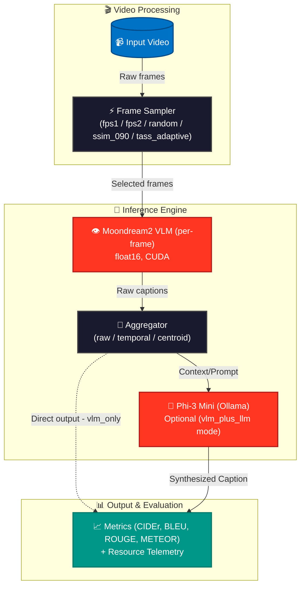

# 📹 Resource-Efficient Video Captioning on Edge Hardware

> **Two-Stage Adaptive Semantic Sampling (TASS) — Benchmark Study** evaluating video frame-sampling strategies for automated video captioning on consumer-grade edge hardware.

<div align="center">


</div>

---

## 📋 Table of Contents

- [Project Overview](#-project-overview)
- [Core Research Question](#-core-research-question)
- [System Architecture](#️-system-architecture)
- [Core Components & Algorithms](#-core-components--algorithms)
- [Aggregation Methods](#-aggregation-methods)
- [Performance Benchmarks](#-performance-benchmarks--results)
- [Why TASS is the Best Sampler](#-why-tass-is-the-best-sampler)
- [Repository Structure](#-repository-structure)
- [Getting Started](#-getting-started--local-setup)
- [Tech Stack & Hardware](#️-tech-stack--hardware)
- [Future Work](#-future-work)

---

## 🎯 Project Overview

This project benchmarks five video frame-sampling strategies for automated video captioning, specifically targeting **consumer-grade edge hardware** — the NVIDIA RTX 4050 Laptop GPU (6 GB VRAM) running under WSL2.

The pipeline works as follows:

```
Video File → Frame Sampler → VLM (Moondream2) per frame → Aggregator → [Optional LLM (Phi-3)] → Caption
```

Each sampler answers the question: **which frames of this video are worth describing?** The sampler's choice directly determines caption quality, processing latency, and memory usage.

The core contribution of this project is **TASS** — a novel two-stage adaptive algorithm that uses perceptual hashing and semantic embeddings (MobileCLIP-S1) to select only the most informative, visually diverse frames, achieving the highest efficiency (CIDEr per frame) of all evaluated methods.

---

## ❓ Core Research Question

> *"Can content-aware, adaptive frame selection significantly reduce computational cost while maintaining or improving caption quality on edge hardware?"*

**Short answer from our benchmarks: Yes.** TASS selects a mean of **6.57 frames** per video (vs. 24.22 for FPS-2) while matching or outperforming all baselines on BLEU-4, ROUGE-L, and METEOR, and delivering nearly **3× higher semantic yield** (quality per frame processed).

---

## 🏗️ System Architecture



---

## ⚡ Core Components & Algorithms

All samplers implement the `BaseSampler` interface: `sample(video_path) → List[np.ndarray]` and `sample_with_metadata(video_path) → dict`.

### 🎯 FPS-1 & FPS-2 (Uniform Sampling)
- **FPS-1**: Selects one frame per second. Mean frames: **16.29**. Deterministic but no content-awareness.
- **FPS-2**: Selects two frames per second. Mean frames: **24.22**. Doubles temporal resolution, highest absolute CIDEr, but higher VLM cost.

### 🎲 Random Sampling
- Targets the same budget as FPS-1 (`ceil(total_frames / fps)`) but draws frame indices uniformly at random. Used primarily as a statistical control.

### 🔍 SSIM-090 (Structural Similarity)
- Triggers acceptance when the SSIM between the current frame and previous accepted frame drops below 0.90.
- **Properties**: Content-aware (structural scene changes), mean frames: **34.44**. Operates in pixel-space only (visual change, not semantic change).

### 🚀 TASS-Adaptive (Research Contribution)
A two-stage pipeline for maximum semantic diversity:
1. **Stage 1 (Purge & pHash)**: Drops degenerate frames (dark/flat) and uses perceptual hashing to skip visually redundant frames.
2. **Stage 2 (MobileCLIP + Greedy FPS)**: Extracts 512-d semantic embeddings and uses Greedy Farthest-Point Sampling with adaptive early stopping to select maximally diverse scenes.
- **Properties**: Lowest frame budget (**6.57 mean**), highest efficiency.

---

## 🥇 Aggregation Methods

### 1. Raw Aggregation
Joins all frame captions with newline separators in temporal order. No deduplication, fastest processing.

### 2. Temporal Aggregation
Deduplicates temporally adjacent captions using **Jaccard similarity** on word tokens. Prevents repetitive VLM output while preserving temporal order.

### 3. Centroid Aggregation
Selects the **single most representative caption** from all frame captions using pairwise text similarity. Best paired with `vlm_plus_llm` as a high-quality visual summary.

---

## 📈 Performance Benchmarks & Results

All numbers are means over 100 videos (MSR-VTT) across all aggregation methods and caption modes.

### Quality Metrics — Best Configuration Per Metric

| Metric | Winner | Value | Notes |
|---|---|---|---|
| **CIDEr** | `fps2 + centroid + vlm_plus_llm` | **0.0719** | Highest absolute captioning quality |
| **BLEU-1** | `fps2 + centroid + vlm_only` | **0.3861** | Word-level precision |
| **BLEU-4** | `tass_adaptive + centroid + vlm_only` | **0.0230** | 4-gram precision (fluency proxy) |
| **ROUGE-L** | `tass_adaptive + centroid + vlm_only` | **0.2819** | Longest common subsequence recall |
| **METEOR** | `tass_adaptive + centroid + vlm_only` | **0.2099** | Synonym-aware recall |
| **Semantic Yield** | `tass_adaptive + centroid + vlm_plus_llm` | **0.0122** | Quality per VLM call (CIDEr/frame) |

### Efficiency Metrics

| Metric | Winner | Value |
|---|---|---|
| **Processing Time** | `fps2 + temporal + vlm_only` | **0.021s** |
| **Selected Frames** | `tass_adaptive` | **6.57** |
| **VRAM Delta** | `fps1/fps2/random + vlm_only` | **0.00 MB** |

---

## 🏆 Why TASS is the Best Sampler

TASS wins on **every efficiency-adjusted metric**:

1. **Semantic Yield**: 3× Better Than FPS-2 (0.0079 CIDEr/frame vs 0.0030)
2. **Quality (No LLM)**: TASS + centroid leads on BLEU-4, ROUGE-L, and METEOR in `vlm_only` mode.
3. **Semantic Diversity**: MobileCLIP cosine distance guarantees that each selected frame is semantically distinct, preventing VLM repetition.
4. **Adaptive Scaling**: Automatically stops when scene diversity drops, self-calibrating to video complexity.
5. **Zero VRAM Overhead**: MobileCLIP runs CPU-only.

---

## 📂 Repository Structure

```
research_project/
├── samplers/                   # Frame selection algorithms (tass, fps, ssim)
├── aggregation/                # Caption aggregation methods (raw, temporal, centroid)
├── models/                     # Model loaders (VLM, LLM, MobileCLIP)
├── pipeline/                   # Core pipeline stages (extraction, captioning)
├── evaluation/                 # Metrics and telemetry (CIDEr, BLEU, VRAM)
├── experiments/                # Benchmark orchestration & running
├── visualization/              # Plot generation
├── configs/                    # Benchmark configuration YAML
└── results/                    # CSVs, plots, JSON metadata
```

---

## 🚀 Getting Started & Local Setup

### Prerequisites
```bash
# Install Python dependencies
pip install -r requirements.txt

# Start Ollama + Phi-3 Mini (Background)
ollama pull phi3:mini
ollama serve
```

*(Note: Ensure KAGGLE_USERNAME and KAGGLE_KEY are set for MSR-VTT dataset download)*

### Running Benchmarks
```bash
# Run all samplers (from config), 100 videos
PYTHONPATH=. python experiments/run_benchmark.py --videos 100

# Run a single sampler
PYTHONPATH=. python experiments/run_benchmark.py --sampler tass_adaptive --videos 100

# Combine CSVs and regenerate plots
PYTHONPATH=. python experiments/combine_results.py
```

---

## 🛠️ Tech Stack & Hardware

| Category | Technology |
|---|---|
| **Hardware Target** | NVIDIA RTX 4050 (6GB VRAM), x86_64, WSL2 Ubuntu |
| **VLM** | `vikhyatk/moondream2` (fp16, CUDA) |
| **LLM** | `phi3:mini` (Ollama) |
| **Embeddings** | `MobileCLIP-S1` (CPU) |
| **Dataset** | MSR-VTT (`vishnutheepb/msrvtt`) |
| **Core Libraries** | PyTorch, OpenCV, HuggingFace Transformers |

---

## 🔮 Future Work

- **TASS Fixed-K Mode Ablation**: Compare against adaptive stopping.
- **Audio-Visual Fusion**: Integrate Whisper for events that are heard but not seen.
- **BLEU-4 Optimization**: Constrained decoding.
- **Mobile GPU Target**: Port to Jetson Orin NX (16 GB).
- **Larger Video Corpus**: Scale to 1000-video evaluation.

<div align="center">

**Built with PyTorch + OpenCV + Moondream2**

</div>
