# TASS (Two-Stage Adaptive Semantic Sampling) Detailed Flowchart

This document provides a detailed layout of the Two-Stage Adaptive Semantic Sampling (TASS) architecture. It indicates which components and algorithms were already existing in the repository (such as parts of the baseline samplers) versus which ones are new integrations custom-built for TASS.

---

## 1. Flowchart (Mermaid Diagram)

The flowchart below illustrates the end-to-end execution of the TASS engine, from reading the video stream to returning the semantically diverse frames and telemetry data.

```mermaid
graph TD
    %% Styling Definitions
    classDef new fill:#e3f2fd,stroke:#2196f3,stroke-width:2px;
    classDef existing fill:#f5f5f5,stroke:#9e9e9e,stroke-width:2px;
    classDef process fill:#fff3e0,stroke:#ff9800,stroke-width:2px;

    %% STAGE 1 Nodes
    Start([Start: Video Path]) --> OpenStream["Open Video Capture Stream<br/><b>cv2.VideoCapture</b><br/><i>Already Existed</i>"]:::existing
    OpenStream --> ReadFrame["Read Next Frame<br/><b>cap.read()</b><br/><i>Already Existed</i>"]:::existing
    
    ReadFrame -- Frame is None / EOF --> Stage2Start["Transition to Stage 2"]:::process
    ReadFrame -- Valid Frame --> DegCheck{"Degenerate Frame?<br/>(Mean Brightness / Var Check)<br/><b>cv2.cvtColor, np.mean, np.var</b><br/><i>NEW</i>"}:::new
    
    DegCheck -- Yes --> DropDeg["Drop Frame & Increment Counter<br/><i>NEW</i>"]:::new
    DropDeg --> ReadFrame
    
    DegCheck -- No --> Resize["Resize to 256x144 Thumbnail<br/><b>cv2.resize (INTER_AREA)</b><br/><i>Already Existed</i>"]:::existing
    Resize --> FirstFrameCheck{"First Frame?"}:::existing
    
    FirstFrameCheck -- Yes --> AddCandidate["Add Frame to Candidate Pool<br/><i>Already Existed</i>"]:::existing
    FirstFrameCheck -- No --> GridSSIM["Compute 2x2 Grid-SSIM Quadrants<br/><b>skimage.metrics.structural_similarity</b><br/><i>NEW</i>"]:::new
    
    GridSSIM --> MinSSIMCheck{"Min Quadrant SSIM < Threshold?<br/><i>NEW</i>"}:::new
    
    MinSSIMCheck -- No (Static / Redundant) --> ReadFrame
    MinSSIMCheck -- Yes (Visual Transition) --> AddCandidate
    
    AddCandidate --> UpdateRef["Update SSIM Reference Image<br/><i>Already Existed</i>"]:::existing
    UpdateRef --> MaxCandidatesCheck{"Candidates >= 2000?<br/><i>NEW</i>"}:::new
    
    MaxCandidatesCheck -- Yes --> Stage2Start
    MaxCandidatesCheck -- No --> ReadFrame

    %% STAGE 2 Nodes
    Stage2Start --> LoadEmbedder["Load MobileCLIP Singleton on CPU<br/><b>open_clip.create_model_and_transforms</b><br/><i>NEW</i>"]:::new
    LoadEmbedder --> MicroBatch["Micro-Batch Frames (size=16)<br/><b>PIL.Image.fromarray, torch.stack</b><br/><i>NEW</i>"]:::new
    MicroBatch --> GenEmbeddings["Generate L2-Normalized Embeddings<br/><b>model.encode_image, features.norm</b><br/><i>NEW</i>"]:::new
    
    GenEmbeddings --> AnchorSelection["Select First Candidate as Anchor<br/><i>NEW</i>"]:::new
    AnchorSelection --> FPSToop{"Need More Frames?<br/>(Check Target K or Pool Exhaustion)<br/><i>NEW</i>"}:::new
    
    FPSToop -- Yes --> ComputeDistances["Compute Cosine Distance to Selected Set<br/><b>1.0 - np.dot(embeddings[i], embeddings[j])</b><br/><i>NEW</i>"]:::new
    
    ComputeDistances --> FindMaxMin["Find Candidate Maximizing Min Distance<br/><i>NEW</i>"]:::new
    
    FindMaxMin --> AdaptiveCheck{"Adaptive Mode &<br/>Best Distance < min_distance?<br/><i>NEW</i>"}:::new
    
    AdaptiveCheck -- Yes --> EarlyStop["Trigger Early Stopping<br/><i>NEW</i>"]:::new
    AdaptiveCheck -- No --> AcceptFrame["Accept Candidate Frame<br/><i>NEW</i>"]:::new
    
    AcceptFrame --> FPSToop
    
    FPSToop -- No (K reached / pool empty) --> SortSelected["Sort Selected Indices Temporally<br/><b>list.sort()</b><br/><i>Already Existed</i>"]:::existing
    EarlyStop --> SortSelected
    
    SortSelected --> ReleaseMemory["Release Candidate Cache & GC<br/><b>gc.collect()</b><br/><i>NEW</i>"]:::new
    ReleaseMemory --> ReturnResult(["Return Frames & Telemetry Dict"]):::process
```

---

## 2. Component Breakdown

Here is a detailed breakdown of the operations in each stage, specifying library imports, classes, methods, and whether the component was pre-existing or custom-developed.

### Stage 1: Streaming Degenerate Purge + Grid-SSIM Pre-filter

This stage runs on the CPU and processes the video frame-by-frame. Its primary purpose is to quickly filter out extreme noise (degenerate frames) and visually redundant content to build a high-quality candidate pool.

| Block Name | Status | Libraries Used | Methods / Functions | Rationale & Implementation Details |
| :--- | :--- | :--- | :--- | :--- |
| **Video Stream Capture** | **Already Existed** | `cv2` | `cv2.VideoCapture()`, `cap.read()`, `cap.isOpened()` | Opens and sequentially reads the video file from disk without loading the entire video into RAM, keeping the memory footprint low. |
| **Degenerate Frame Detector** | **NEW** | `cv2`, `numpy` | `cv2.cvtColor(frame, cv2.COLOR_BGR2GRAY)`, `np.mean()`, `np.var()` | Checks full-resolution frames for extreme lighting conditions: mean brightness `> 245` (flash/overexposure) or `< 8` (deep fade/lens cap), and pixel variance `< 80` (uniform color cards/static noise). |
| **Thumbnail Downscaling** | **Already Existed** | `cv2` | `cv2.resize(..., interpolation=cv2.INTER_AREA)`, `cv2.cvtColor()` | Scales valid frames down to a uniform 256x144 thumbnail size to minimize the computational cost of downstream SSIM calculations. |
| **2x2 Grid-SSIM Filter** | **NEW** | `scikit-image` | `skimage.metrics.structural_similarity()` | Instead of computing global SSIM (which is prone to masking foreground motion with static backgrounds), this splits the frame into 4 quadrants (2x2 grid) and computes SSIM independently in each. The **minimum** score is returned. |
| **SSIM Decision & Reference Update** | **Already Existed** | Python | `< self.threshold` comparison | If the minimum quadrant SSIM is below the threshold (e.g. `0.90`), the frame is admitted. The reference image for the next comparison is updated **only** on frame acceptance. |
| **Safety Pool Cap** | **NEW** | Python | `len(candidate_frames) >= 2000` check | Caps the candidate pool at `2000` frames to prevent runaway memory usage on pathologically long, low-SSIM videos. |

---

### Stage 2: Micro-Batched MobileCLIP + Greedy Farthest-Point Selection

This stage operates on the candidate frames generated by Stage 1. It extracts deep semantic features using a lightweight CPU model and picks the most diverse frame subset.

| Block Name | Status | Libraries Used | Methods / Functions | Rationale & Implementation Details |
| :--- | :--- | :--- | :--- | :--- |
| **MobileCLIP Singleton Loader** | **NEW** | `open-clip` | `open_clip.create_model_and_transforms()` | Loads `MobileCLIP-S1` weights (`datacompdr` pretraining) onto the CPU. Implements a Singleton pattern to avoid reloading weights across multiple videos in a benchmark run. Runs entirely on CPU to save VRAM for the primary captioning VLM (Moondream2). |
| **Micro-Batch Image Preprocessing** | **NEW** | `PIL`, `torch` | `PIL.Image.fromarray()`, `torch.stack()` | Reverses the channels in-place (`f[:, :, ::-1]`) to convert OpenCV's BGR format to RGB view, wraps in a PIL Image, applies the CLIP preprocess transform, and stacks them into batches of size `16` (to prevent memory spikes). |
| **L2-Normalized Embedding Extraction** | **NEW** | `torch` | `model.encode_image()`, `features.norm()` | Extracts 512-dimensional semantic embeddings from the model. Embeddings are normalized by their L2 norm to allow cosine similarity to be calculated via simple dot products. |
| **Greedy Farthest-Point Selection (FPS)** | **NEW** | `numpy` | `np.dot()` | Anchors the selection with the first frame of the video. Iteratively selects the next frame that maximizes the minimum distance (1 - cosine similarity) to all already-selected frames. This gives a mathematically optimal approximation to the max-min diversity problem. |
| **Adaptive Early Stopping** | **NEW** | Python | `< self.min_distance` comparison | In `adaptive` mode, if the maximum-minimum cosine distance of the best remaining candidate to the selected set falls below `min_distance` (e.g. `0.10`), selection stops immediately to prevent capturing duplicate concepts. |
| **Temporal Index Sorting** | **Already Existed** | Python | `selected_pool_indices.sort()` | Sorts the chosen frame indices chronologically to preserve the original temporal flow of the video for the downstream VLM. |
| **Memory Cleanup & GC** | **NEW** | `gc` | `del candidate_frames`, `gc.collect()` | Explicitly deletes candidate frame objects and triggers python garbage collection to free RAM as early as possible. |
